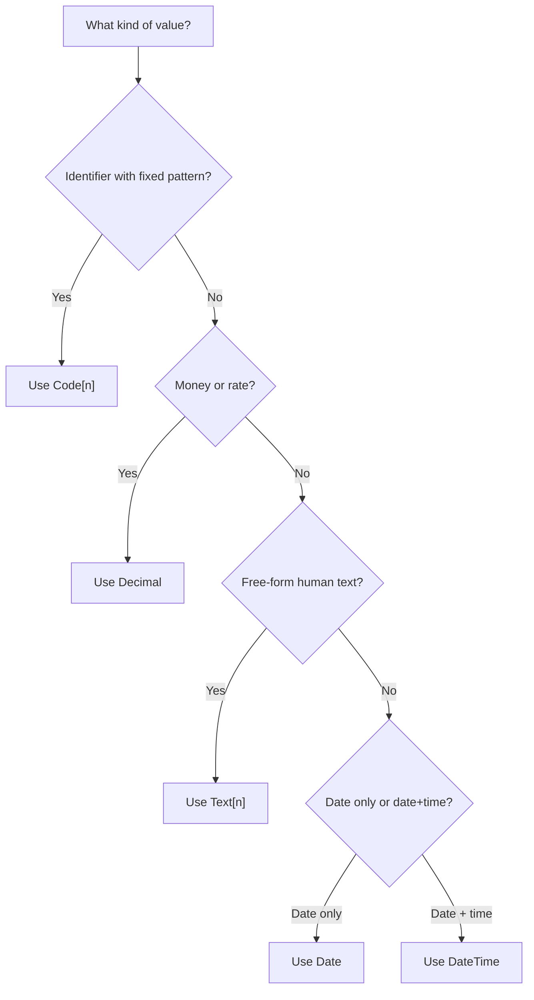

# Chapter 4: Data Types and Variables in AL

## Objectives

By the end of this chapter you will be able to:

- ✅ Choose appropriate AL primitive and complex data types
- ✅ Declare variables with intent and clear scope
- ✅ Avoid common type-related errors in business logic
- ✅ Prepare strongly typed data handling for table/page work in Chapter 7 and 8

## 4.1 Primitive Data Types

AL primitive types include `Integer`, `Decimal`, `Boolean`, `Text`, `Date`, and `DateTime`. Pick the narrowest type that still matches business meaning.

- Use `Decimal` for money and rates.
- Use `Code[n]` for compact identifiers (for example, document numbers).
- Use `Text[n]` for free-form descriptive fields.

## 4.2 Complex Data Types

Common complex types include:

- `Record` for table rows
- `List` and `Dictionary` for in-memory collections
- Enums/options for constrained business states

Most business workflows in this book pass `Record` values into codeunit procedures, especially from Chapter 9 onward.

## 4.3 Variable Declaration and Scope

```al
procedure CalculateInstallmentAmount(Principal: Decimal; InterestRate: Decimal): Decimal
var
    InterestAmount: Decimal;
begin
    InterestAmount := Principal * InterestRate;
    exit(Principal + InterestAmount);
end;
```

Prefer local variables inside procedures. Keep global variables only when state must be shared across procedures in the same object.

## 4.4 Type-Safety Patterns You Will Reuse

- Validate assumptions early with `TestField` or explicit `Error`.
- Avoid implicit conversions that hide precision or truncation issues.
- Keep identifier types consistent across objects (for example, loan number as `Code[20]` everywhere).

These habits reduce downstream defects in table triggers and codeunit logic.

## 4.5 Type Selection Flow (Visual Guide)

Use this quick flow whenever you're unsure which type to pick:



## Chapter Summary

- ✅ You reviewed key AL primitive and complex types
- ✅ You practiced purposeful variable declaration and scope control
- ✅ You learned type-safety habits that prevent later business-logic bugs
- ✅ You prepared for strongly typed table and codeunit development

---

## Tasks

1. **Type review (starter set).** Classify these fields and justify each choice in one line: `Loan No.`, `Installment No.`, `Principal Amount`, `Paid`, `Due Date`, `Payment Date`.
2. **Boundary practice.** For `Code[20]`, `Text[100]`, and `Decimal`, write one valid and one invalid sample value for each type.
3. **Variable scope cleanup.** Move at least two global variables into a local procedure scope where they are only used once.
4. **Consistent identifier typing.** Check every place where `Loan No.` is used and ensure the type is consistently `Code[20]`.
5. **Validation guard.** Add explicit validation so `Principal Amount` and `Interest Amount` cannot be zero or negative before calculation.
6. **Try it yourself.** Add one extra field of your choice (for example, `External Reference`) and decide whether it should be `Code` or `Text`, with reasoning.

**Check your work:** compare your answers with `/solutions/chapter4/TASKS.md`, then confirm your type choices stay consistent in Chapters 7, 9, and 15.
