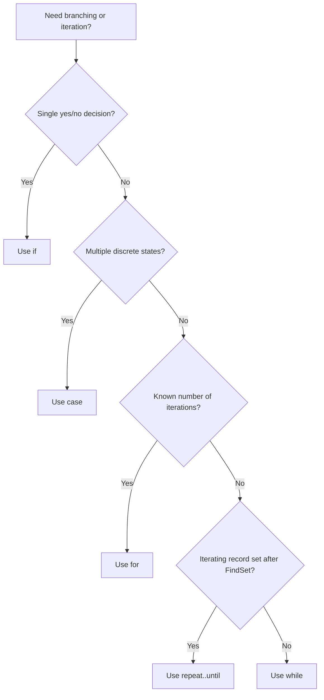

# Chapter 6: Control Structures

## Objectives

By the end of this chapter you will be able to:

- ✅ Use `if`, `case`, and loops appropriately in AL
- ✅ Choose between `for`, `while`, and `repeat..until` based on intent
- ✅ Apply safe error handling patterns for business rules
- ✅ Write control flow that scales to real data volumes

## 6.1 Conditional Statements (`if` and `case`)

Use `if` for binary or short decision trees. Use `case` for multiple discrete branches.

```al
if Score >= 90 then
    Grade := 'A'
else
    if Score >= 80 then
        Grade := 'B'
    else
        Grade := 'C';
```

```al
case DocumentStatus of
    DocumentStatus::Open:
        HandleOpen();
    DocumentStatus::Released:
        HandleReleased();
else
    Error('Unsupported status: %1', Format(DocumentStatus));
end;
```

## 6.2 Looping Constructs

Use the loop type that matches business behavior:

- `for`: known iteration count (for example, fixed installments)
- `while`: condition-driven iteration
- `repeat..until`: record traversal after `FindSet`

```al
if Customer.FindSet() then
    repeat
        ProcessCustomer(Customer);
    until Customer.Next() = 0;
```

This pattern is heavily used in Chapters 9 and 13.

## 6.3 Error Handling and Assertions

Use `Error` to stop invalid transactions early.

```al
if Amount <= 0 then
    Error('Amount must be greater than zero.');
```

In tests (Chapter 14), use assertions to prove behavior, rather than manual UI checks.

## 6.4 Control-Flow Quality Guidelines

- Keep nested depth low; extract helper procedures.
- Fail fast on invalid data.
- Never use loops when a filtered set would do (see Chapter 13).

## 6.5 Control-Structure Decision Map (Visual Guide)



## Chapter Summary

- ✅ You applied AL conditionals and loops with clear selection criteria
- ✅ You used repeatable record-iteration patterns
- ✅ You added safe, explicit error handling in business rules
- ✅ You prepared control-flow techniques reused in codeunits and tests

---

## Tasks

1. **Branching choice.** Replace one overgrown `if` chain with a `case` where appropriate.
2. **Decision fallback.** Add an `else` branch (or `case else`) that raises an `Error` for unsupported state values.
3. **Loop correction.** Refactor one loop to use `FindSet` + `repeat..until` for record traversal.
4. **Loop intent check.** Convert one loop to `for` when the iteration count is known ahead of time.
5. **Guard clause.** Add one fail-fast `Error` that protects invalid input before any data changes.
6. **Try it yourself.** Extract one nested block into a helper procedure to reduce nesting depth.

**Check your work:** compare your answers with `/solutions/chapter6/TASKS.md`, then verify your loop and branching style aligns with Chapters 9, 13, and 14 patterns.
